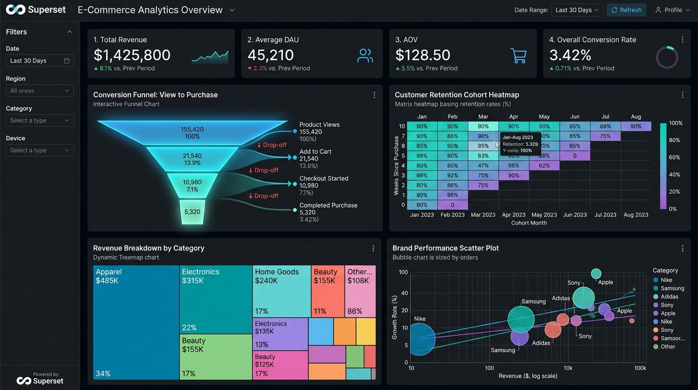
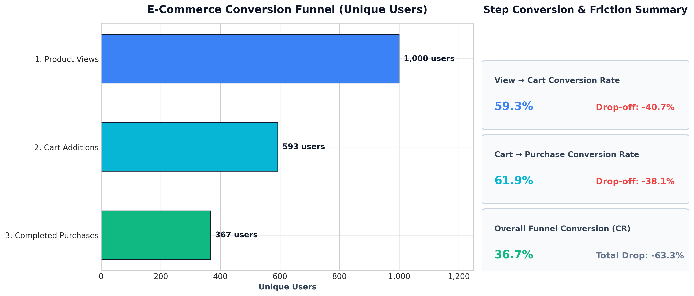
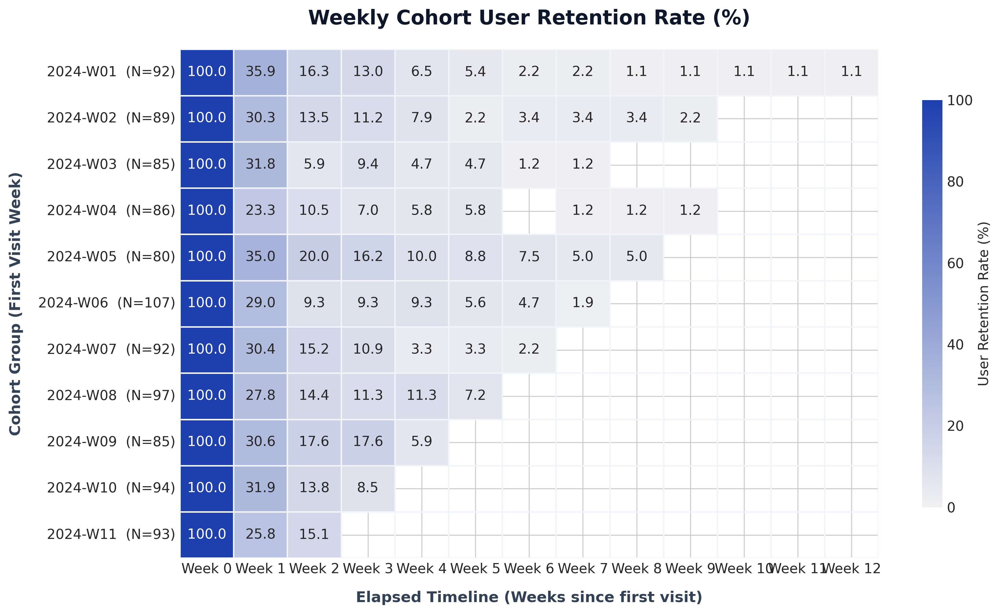
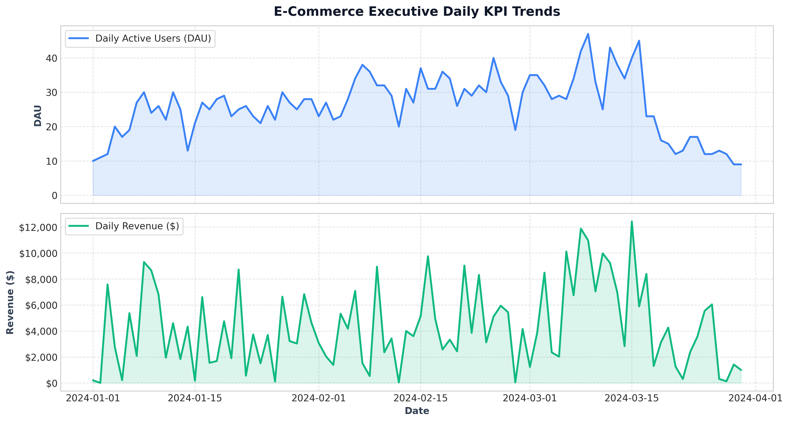

# E-commerce Funnel & Retention Analysis

Production-grade Data Engineering & Product Analytics project implementing **Clickstream Sessionization**, **Conversion Funnel Analysis**, **Time-to-Buy (TTB) Tracking**, **Polars Cohort Retention Matrix Engine**, and **Apache Superset BI Data Marts** on multi-million row e-commerce clickstream data.



---

## 1. Visual Analytics & Core Insights

### Conversion Funnel & Drop-off Friction
Tracks strict sequential user transitions ($View \rightarrow Cart \rightarrow Purchase$) per session, isolating drop-off bottlenecks and measuring step conversion rates alongside Time-to-Buy (TTB).



### Cohort User Retention Matrix
High-performance cohort retention engine computed with **Polars LazyFrames**, grouping users by their initial acquisition week and tracking behavioral decay over subsequent weeks.



### Executive Daily KPI Trends
Continuous tracking of Daily Active Users (DAU), Gross Merchandise Volume (Revenue), and Average Order Value (AOV) across all product categories.



---

## 2. Context & Data Architecture

This project models and analyzes user shopping journeys, friction points, and retention dynamics in multi-category retail environments.

### Data Schema (`raw_events`)

| Field | Type | Description |
| :--- | :--- | :--- |
| `event_time` | `TIMESTAMPTZ` | UTC timestamp of the clickstream event |
| `event_type` | `VARCHAR(30)` | Action type (`view`, `cart`, `remove_from_cart`, `purchase`) |
| `product_id` | `BIGINT` | Unique product SKU identifier |
| `category_id` | `BIGINT` | Broad category identifier |
| `category_code` | `VARCHAR(255)` | Hierarchical category string (e.g. `electronics.smartphone`) |
| `brand` | `VARCHAR(255)` | Manufacturer brand name |
| `price` | `NUMERIC(10, 2)` | Product price in USD |
| `user_id` | `BIGINT` | Unique user identifier |
| `user_session` | `UUID` | Frontend clickstream session identifier |

---

## 3. Technical Stack & Key Decisions

- **Database**: PostgreSQL 15+ with Range Partitioning by `event_time` and composite indexes on `(user_id, event_time)` and `(event_type, event_time)`.
- **SQL Analytics**: Strict use of Window Functions (`LAG`, `ROW_NUMBER`, `FIRST_VALUE`, `SUM() OVER`) and CTEs. Zero reliance on plain `GROUP BY` for funnel ordering.
- **Python Engine**: **Polars** (`polars>=0.20.0`) utilizing lazy evaluation (`scan_parquet` / `scan_csv`) to process tens of millions of clickstream events in streaming mode with minimal RAM footprint.
- **Visualization**: Interactive Plotly Cohort Heatmaps (`plotly.graph_objects`), Matplotlib/Seaborn report exports, and Apache Superset BI Data Marts.

---

## 4. Quick Start & Execution Guide

### Step 1: DDL & Database Sessionization (SQL)
Run `sql/01_ddl_and_sessionization.sql` in PostgreSQL:
```bash
psql -h localhost -U postgres -d ecommerce_db -f sql/01_ddl_and_sessionization.sql
```
> [!NOTE]
> Reconstructs missing/broken frontend sessions using a **30-minute inactivity window** via `LAG(event_time) OVER (PARTITION BY user_id ORDER BY event_time)`.

### Step 2: Funnel & Time-to-Buy (TTB) Calculation (SQL)
Run `sql/02_funnel_and_dropoff.sql`:
```bash
psql -h localhost -U postgres -d ecommerce_db -f sql/02_funnel_and_dropoff.sql
```
> [!NOTE]
> Computes strict sequential step progression (`View` $\rightarrow$ `Cart` $\rightarrow$ `Purchase`) per user session, calculating unique users, step conversion rates (CR %), drop-off rates (% loss), and TTB (Time-to-Buy in minutes).

### Step 3: Cohort & Retention Analysis (Python Polars)
Install dependencies and run the cohort analysis engine:
```bash
pip install -r requirements.txt

# 1. (Optional) Generate synthetic dataset
python python/generate_sample_data.py

# 2. Run weekly cohort retention study & generate interactive heatmap
python python/retention_analysis.py --input data/sample_raw_events.parquet --granularity W --output_html docs/cohort_retention_heatmap.html
```
> [!TIP]
> Open `docs/cohort_retention_heatmap.html` in any browser to inspect the interactive Plotly heatmap with retention percentages and hover details.

### Step 4: BI Analytical Views & Superset Dashboard
Deploy `sql/03_superset_views.sql` to expose production data marts to Apache Superset:
- `v_kpi_daily`: Daily DAU, Revenue, AOV, ARPU, Overall CR.
- `v_funnel_summary`: Daily funnel aggregated by category & brand.
- `v_cohort_retention`: Flat cohort dataset for BI heatmaps.

Refer to [`docs/superset_dashboard_spec.md`](docs/superset_dashboard_spec.md) for full dashboard specifications, chart configurations, and Jinja filters.
